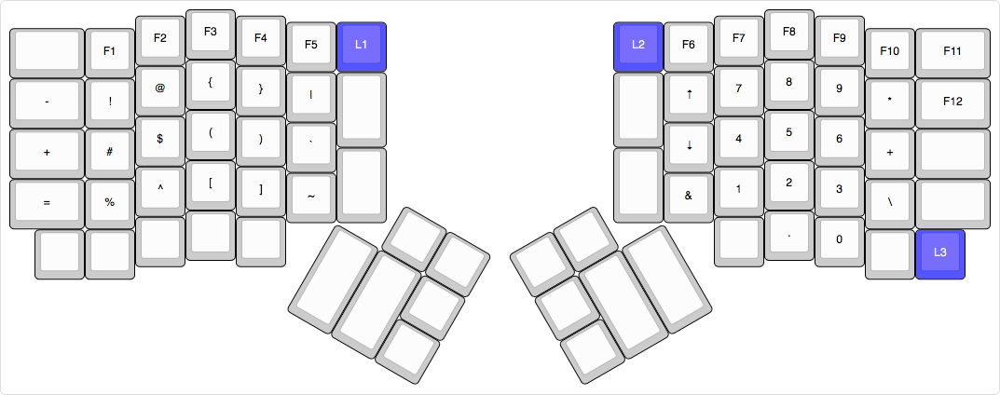

# ErgoDox EZ - Tom-Eric's settings

So, I took the default firmware and just made a couple of tweaks that make it
easier to use. I also added a [Plover](../plover/) layer to play around with.

## 0. Base Layer

## 1. Coder Layer

## 2. Media/Mouse Layer

## 3. Plover Layer

